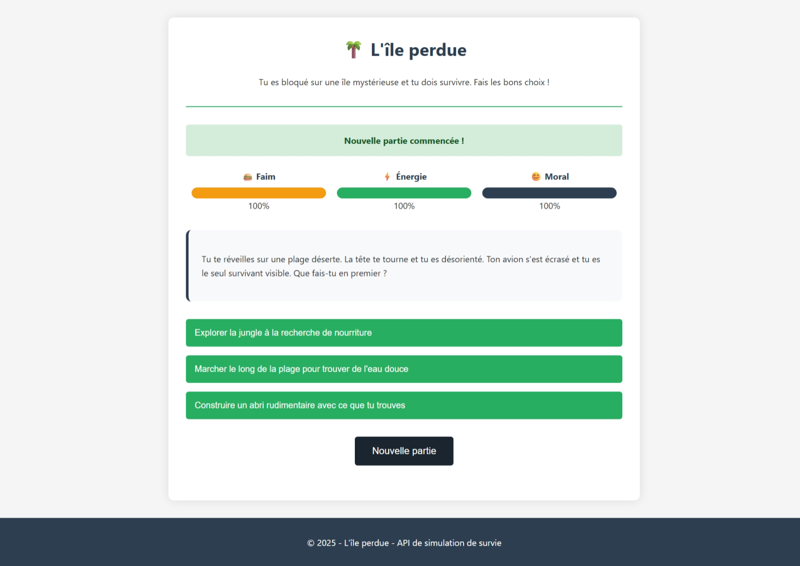

# 🏝️ API de simulation de survie – L'île perdue

## 📖 Description

Ce projet est une API de simulation de survie où l'utilisateur se retrouve bloqué sur une île mystérieuse. Chaque jour, il doit faire des choix qui affectent ses statistiques de survie : faim, énergie et moral.

## 👀 Aperçu


## 🌟 Fonctionnalités

- Système de scénarios avec différentes options de choix
- Calcul automatique des statistiques de joueur en fonction des choix
- Interface utilisateur simple pour jouer
- API REST documentée pour intégration dans d'autres projets

## 🛠️ Technologies utilisées

- Django 4.2
- Django REST Framework
- SQLite (base de données)
- HTML/CSS/JavaScript (interface utilisateur)

## 🏗️ Structure du projet

- `survie_api/models.py` : Modèles de données (Scenario, Choix, JoueurState)
- `survie_api/views.py` : Vues API et interface utilisateur
- `survie_api/serializers.py` : Sérialiseurs pour l'API REST
- `survie_api/templates/` : Templates HTML pour l'interface utilisateur

## 🚀 Installation

1. Cloner le dépôt

```bash
git clone <url-du-repo>
cd api_survie
```

2. Créer un environnement virtuel et l'activer

```bash
python -m venv venv
source venv/bin/activate  # Pour Linux/Mac
# OU
venv\Scripts\activate  # Pour Windows
```

3. Installer les dépendances

```bash
pip install -r requirements.txt
```

4. Appliquer les migrations

```bash
python manage.py migrate
```

5. Créer des données de test

```bash
python manage.py seed_data
```

6. Démarrer le serveur de développement

```bash
python manage.py runserver
```

7. Accéder à l'application
   - Interface utilisateur : http://127.0.0.1:8000/
   - API REST : http://127.0.0.1:8000/api/
   - Administration : http://127.0.0.1:8000/admin/

## 📡 Points d'API

### Obtenir un scénario
```
GET /api/scenario/<id>/
```

### Faire un choix
```
POST /api/scenario/<id>/choisir/<choix_id>/
```

### Nouvelle partie
```
POST /api/nouvelle-partie/
```

## 👨‍💻 Développement

Pour ajouter de nouveaux scénarios et choix, vous pouvez :

1. Utiliser l'interface d'administration
2. Modifier le fichier `survie_api/management/commands/seed_data.py` et relancer la commande

## 📝 Notes de conception

Le système est basé sur trois métriques principales :
- **Faim** (0-100) : Représente le niveau de satiété du joueur
- **Énergie** (0-100) : Représente le niveau d'énergie du joueur
- **Moral** (0-100) : Représente l'état mental du joueur

Chaque choix effectué modifie ces métriques à la hausse ou à la baisse, et peut mener à différents scénarios.

## 📜 License

[MIT License](LICENSE)
